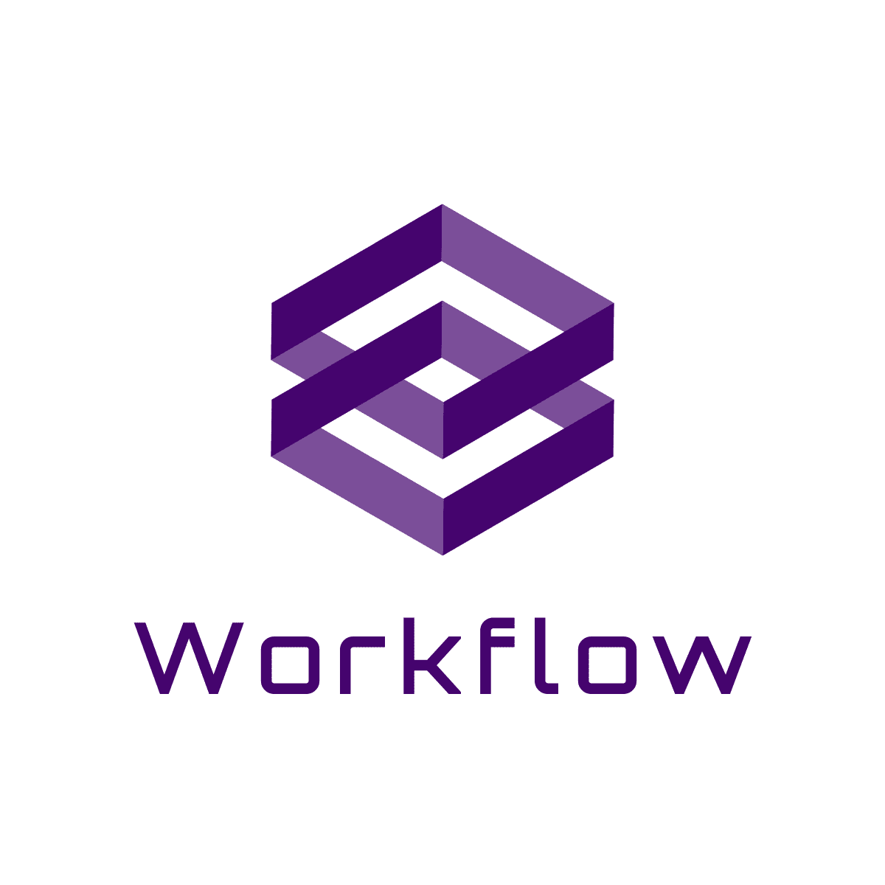
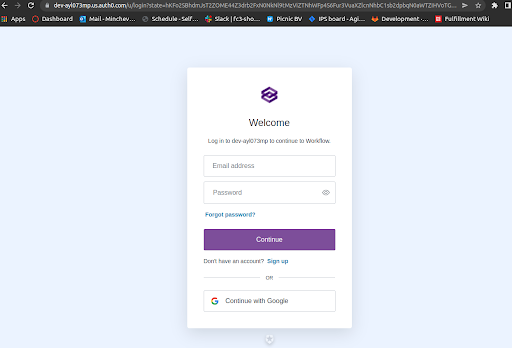
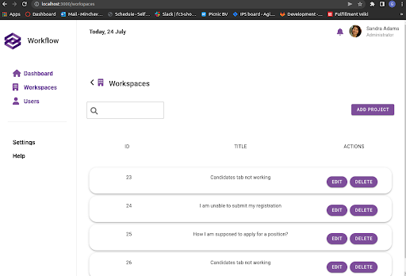
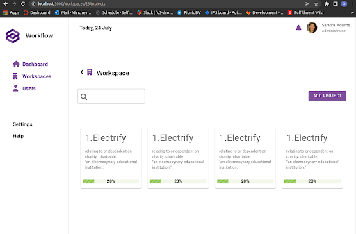

<!-- PROJECT SHIELDS -->
<!--
*** I'm using markdown "reference style" links for readability.
*** Reference links are enclosed in brackets [ ] instead of parentheses ( ).
*** See the bottom of this document for the declaration of the reference variables
*** for contributors-url, forks-url, etc. This is an optional, concise syntax you may use.
*** https://www.markdownguide.org/basic-syntax/#reference-style-links
-->

[//]: # ([![Contributors][contributors-shield]][contributors-url])

[//]: # ([![Forks][forks-shield]][forks-url])

[//]: # ([![Stargazers][stars-shield]][stars-url])

[//]: # ([![Issues][issues-shield]][issues-url])

[//]: # ([![MIT License][license-shield]][license-url])


<!-- PROJECT LOGO -->
<br />

This repository contains my semester 6 individual project - Workflow.

<table align="center"><tr><td align="center" width="9999">
<a align="center" href="https://git.fhict.nl/I425926/s6-its-workflow">
    
</a>

<h3 align="center">Project Management System</h3>

</td></tr></table>


<!-- TABLE OF CONTENTS -->
## Table of Contents

* [About the Project](#about-the-project)
    * [Built With](#built-with)
* [Documentation](#documentation)
    * [Roadmap](#roadmap)
* [Getting Started](#getting-started)
    * [Prerequisites](#prerequisites)
    * [Installation](#installation)
* [Security and Static Code Analysis](#usage)
* [Contributing](#contributing)
* [License](#license)
* [Contact](#contact)
* [Acknowledgements](#acknowledgements)


<!-- ABOUT THE PROJECT -->
## About The Project

[//]: # ([![Product Name Screen Shot][product-screenshot-1]]&#40;https://example.com&#41;)

[//]: # ([![Product Name Screen Shot][product-screenshot-2]]&#40;https://example.com&#41;)

This repository represents the Workflow's project management system. Workflow is a system for managing project task progress, project planning and team coordination and collaboration. It assists project managers and teams in organizing and managing their projects and tasks effectively.
The system has three users:

* Admin - perform administration work such as creating the users and projects in the system

* Project Managers - manage project activities such as tracking project progress and splitting the project goals into subtasks and assigning them to team members

* Employees (team members) - track their own work and collaborate with team members on projects

<table align="center"><tr><td align="center" width="9999">
<a align="center">
    
    <br><br>
    
    <br><br>
    

</a>

</td></tr></table>

<!-- ABOUT THE PROJECT -->
## System Architecture

The system implements event-driven microservices architecture. Attributes relevant to the enterprise context such as high volume data, performance, availability and responsiveness are considered during the planning and implementation. 
A C2 Container Diagram of the system can be found on the following [link](https://drive.google.com/file/d/1jvbVqbCpPpltqAh49h3TAgtVVSO8fZt1/view?usp=sharing).

### Built With

* [Java](https://www.java.com/en/)
* [Spring Boot](https://spring.io/projects/spring-boot)
* [Gradle](https://gradle.org/)
* [RabbitMQ](https://www.rabbitmq.com/)

<!-- DOCUMENTATION -->
## Documentation
To gain more understanding of the project check the following documents:

* [Project Plan](https://docs.google.com/document/d/1GaTFIL_dKK2oHjlqHU-VbBQeGViMIqki/edit?usp=sharing&ouid=101105941692990500407&rtpof=true&sd=true)
* [User Requirements Specifications(URS)](https://docs.google.com/document/d/1snw7scpE8zxjAcUrIWlM4fIIPhNN-3T9/edit?usp=sharing&ouid=101105941692990500407&rtpof=true&sd=true)
* [Technical design document](https://docs.google.com/document/d/1TDGCsUTOfShhgvKavCLul6ujHONXIKiohDkV61AOHKw/edit?usp=sharing)

<!-- ROADMAP -->
### Roadmap

See the Workflow [Jira backlog](https://individual-project.atlassian.net/jira/software/projects/IPS/boards/1) for a list the features (and known issues).


<!-- GETTING STARTED -->
## Getting Started


### Prerequisites

To run the project `local environment` you should first install the following prerequisites:

* gradle ([how to install gradle](https://gradle.org/install/))
* docker ([how to install docker](https://docs.docker.com/engine/install/))
* docker-compose ([how to install docker-compose](https://docs.docker.com/compose/install/))

### Installation

To clone and run the project enter in your command line the following:
```sh
# Clone this repository
git clone --recurse-submodules https://git.fhict.nl/I425926/orchestrate-workflow.git

# Go into the repository
$ cd orchestrate-workflow

# Build the backend project with Gradle
$ make build-backend

# Rebuild the backend project with Gradle
$ make rebuild-backend

#Build the frontend project with npm
$ make build-frontend

# Build the Docker images, create and start a Docker container for each service including frontend
$ make up
```
<br>

To stop the project run:
```sh
$ make down
```
To restart the project run:
```sh
$ make down
```

<!-- USAGE EXAMPLES -->
## Security and Static Code Analysis

[SonarQube](https://www.sonarqube.org/) tool for static code analysis and security inspections is integrated in the Gitlab CI/CD.
The SonarQube instance is hosted on a Digital Ocean cloud. To access it:

Go the the following link http://128.199.38.65:9000/projects and use the following credentials:

admin: `admin`

password: `sonar`

<!-- USAGE EXAMPLES -->
## End-to-end testing

[Nightwatch.js](https://nightwatchjs.org/) end-to-end tests are integrated in the CI pipeline and are executed automatically when the pipeline runs.
They can also be ran locally with the following commands:

Run Nightwatch end-to-end tests locally:
```sh
#If frontend project is not built run
$ make build-frontend

#Go into the frontend project
$ cd s6-its-workflow-frontend/Workflow-frontend

#Run the project
$ npm run dev

#Execute ent-to-end tests
$ npm run test ./tests/main.js

```

<!-- LICENSE -->
## License

Distributed under the MIT License. See `LICENSE` for more information.


<!-- CONTACT -->
## Contact

Georgi Minchev - [gminchev.nl@gmail.com]()

Project Link: [https://git.fhict.nl/I425926/s6-its-workflow](https://git.fhict.nl/I425926/s6-its-workflow)


<!-- ACKNOWLEDGEMENTS -->

[//]: # (## Acknowledgements)

[//]: # (* [GitHub Emoji Cheat Sheet]&#40;https://www.webpagefx.com/tools/emoji-cheat-sheet&#41;)

[//]: # (* [Img Shields]&#40;https://shields.io&#41;)

[//]: # (* [Choose an Open Source License]&#40;https://choosealicense.com&#41;)

[//]: # (* [GitHub Pages]&#40;https://pages.github.com&#41;)

[//]: # (* [Animate.css]&#40;https://daneden.github.io/animate.css&#41;)

[//]: # (* [Loaders.css]&#40;https://connoratherton.com/loaders&#41;)

[//]: # (* [Slick Carousel]&#40;https://kenwheeler.github.io/slick&#41;)

[//]: # (* [Smooth Scroll]&#40;https://github.com/cferdinandi/smooth-scroll&#41;)

[//]: # (* [Sticky Kit]&#40;http://leafo.net/sticky-kit&#41;)

[//]: # (* [JVectorMap]&#40;http://jvectormap.com&#41;)

[//]: # (* [Font Awesome]&#40;https://fontawesome.com&#41;)


<!-- MARKDOWN LINKS & IMAGES -->
<!-- https://www.markdownguide.org/basic-syntax/#reference-style-links -->
[license-shield]: https://img.shields.io/github/license/othneildrew/Best-README-Template.svg?style=flat-square
[license-url]: https://github.com/othneildrew/Best-README-Template/blob/master/LICENSE.txt
[product-screenshot-1]: images/Screenshot_1.png
[product-screenshot-2]: images/Screenshot_2.png
